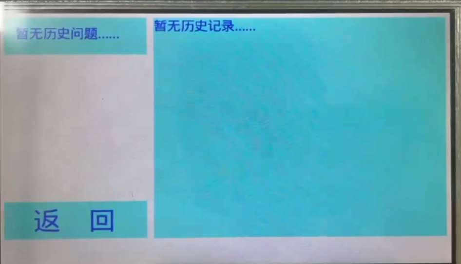

# **基于GEC6818的语音识别ChatGLM终端**

### 1. 产品开发过程

#### 1.1客户端设计

##### 1.1.1硬件情况
本项目产品开发基于粤嵌GEC6818开发板，其LCD屏幕显示分辨率为800x480，具有电容触摸检测层(系统映射坐标范围：1024x600)，并且具有采集麦克风提供录音功能。

##### 1.1.2UI设计

由于电容检测层在硬件选择上获取到的像素并不能与显示分辨率一一对应(1024x600),故通过事件处理层接口获取到坐标像素点后要通过两个坐标系的线性映射获得真正屏幕的坐标点来对应显示。

在显示方面，由于采用的是LCD屏幕，其实现驱动类似触摸屏驱动调用，考虑到每次刷新屏幕都需要完成：打开LCD设备->写入颜色数据->关闭LCD，如果直接进行以上的步骤进行显示的刷新，刷新的效率不高，显示的效果相对割裂，所以我们在显示方面进行mmap内存映射，通过对映射空间写入数据，屏幕自动同步数据到设备中完成显示，极大程度的降低显示刷新所需要的时间。而在显示字库的使用上我们使用的是freetype字库，通过提供好的接口进行直接调用。而字库函数接口是我们这次项目UI制作的关键。
在上文我们得知其显示跟触控其实根本就不在一个图层的，因此在UI制作下可以先将框体绘制好，确定好字号、框体颜色、字体颜色等初始化部分封装好，以方便调用。

这时候又有人想问了：如何刷新返回来的文字呢？这很简单，只需要在需要刷新的区域上面再新建一次框体，把所需要刷新的文字显示在上面把原来的框体覆盖掉，由于每次新建框体都正确的开关了设备，因此在实际操作中也不会出现内存的段错误等致命的问题，唯一需要注意的问题是：每次载入返回的buffer前就需要通过memset函数进行缓存的情况，以避免刷新完的汉字无法覆盖全部的内容而导致后续的字符串仍残留在buffer中，导致后续显示的乱码。

虽然框体跟触控并不在一个图层，但是我们可以想办法让他们的坐标进行重合，通过计算框体坐标以及框体的宽高即可获得显示图层的坐标范围，如果我们获取到坐标范围内的坐标，则进行下一步的事件响应。
当然我们先不着急完成事件的绑定，考虑到历史记录没有的情况，历史记录有一个的情况，历史记录有两个的情况……历史记录有超过四个的情况下显示的效果都各不相同，在历史记录UI设计的同时也要考虑记录的多少进行实际的显示，在经过反复考虑后我们的解决办法是：先初始化一个最基本的界面，通过获取得到的历史记录的计数器进行对应的显示，按照制作主菜单的界面的方式制作历史记录的初始化界面。通过出现的历史记录进行框体的刷新：若有两个历史记录，则在白色区域再刷新一个历史记录问题，第一个问题的覆盖“暂无历史问题”，并且将第二个问题的回答覆盖到右边的历史记录中。直到四个历史记录全部记录后再进行输入，将第一个历史问题和历史记录进行覆盖，只保留2345个问题和对应的答案。

##### 1.1.3整体框架搭建
根据以上的理论和模块后，我们可以很容易的搭建一个框架：

通过循环获取得到的坐标点，进行任务的选择，如果处于选定的范围内则进行事件的响应，响应完毕后通过写好的刷新显示的接口对内容进行更新，在历史记录界面内则与主循环一致，具体实现框架如下：

##### 1.1.4历史记录数据结构

由于进入历史记录界面我们需要将获得的历史记录进行加载，以便用户进行点击查询，而其历史记录状态有可能为空，也有可能有多个，为了解决这个问题，我们采用双结构体的形式进行记录的存储。其中外结构体用来记录整体的历史记录以及载入计数器（用于历史记录的加载和后续的点击），内层结构体则存储历史问题和历史回答，当历史记录长度超过4后将0的位号给原来的1的位号，1的位号给2，以此类推加入新的历史记录，实现四个历史问题按照队列的形式循环更新。并且当历史记录返回主界面的时候将最后一个问题的答案和缓存重新载入给主界面的问题框体和回答框体中，降低用户的使用割裂感。

##### 1.1.5客户端与服务端TCP通信

本项目均按照TCP协议进行客户端与服务端的数据传输，通过read/write函数进行文件的数据流传输。

##### 1.1.6 科大讯飞AI语音识别

在先前写好的框架中，当用户点击“语音输入”则进行语音的识别，其程序具体流程如下图：（与服务器连接部分在程序初始化已经完成）

##### 1.1.7 ChatGLM大模型响应

在用户语音录入和返回识别效果无误后点击“语义理解”，其具体流程如下：

##### 1.1.8答案显示优化

在调试中我们不难发现，ChatGLM接口调用的token限制虽然提供给我们使用了，我们可以根据需要显示字数的多少进行显示，但是通过实践不难发现：当token调节为200时虽然显示的字数有了很好的抑制，总返回字数小于屏幕的最大显示字数，但是其显示的句子并不全，有种话没说完就被强行截断的样子，若token调节为400时虽然显示的内容是完整的，但是我们无法一次性显示完整的内容。于是我们在get_touch函数中做文章，通过多次获取触控像素点取模进行比对，可以判定用户的手指滑动的方向，从而进行字体框内文字的整体偏移，达到类似滑动显示的效果，从而解决答案显示不全的问题。

并且我们也留意到，大模型返回的文字中会出现部分的emoticon，比如：当用户发送“你好”的时候模型会返回文字的同时返回挥手的表情。尽管这样的模型会更加的灵动，但是受限于我们freetype字库并没有此类的表情，直接返回回客户端只会导致后续的文本因为表情的影响而编码错误乱码。同时将返回的文本转化为字符串的形式其“\n”会因为原来底层的转换变成“\\n”,使原来的换行符失效，因此在服务器调用的Python脚本中，我们通过正则表达式替换表情符号，直接去除被转换后的换行符号再进行数据的返回。

#### 1.2服务器端设计

在客户端的铺垫下服务器需要实现哪些功能也清晰明了了。并且服务器不能够轻易退出程序，需要有着较好的稳定性，即需要在客户端断开连接后继续等待连接，而具体实现主要通过Socket网络编程以及AI脚本的调用，服务器总流程框图如下图所示：

##### 1.3最终实现效果

用户根据相应的提示进行语音输入，等待服务器识别返回结果无误后进行语义理解，若识别有出入可以重新进行语音输入直至输入正确，再进行语义理解等待服务器返回结果，在历史记录的存储中系统对空语音输入导致的空结果返回做了界定，若出现返回值为空的情况则不进行历史记录的存储。

